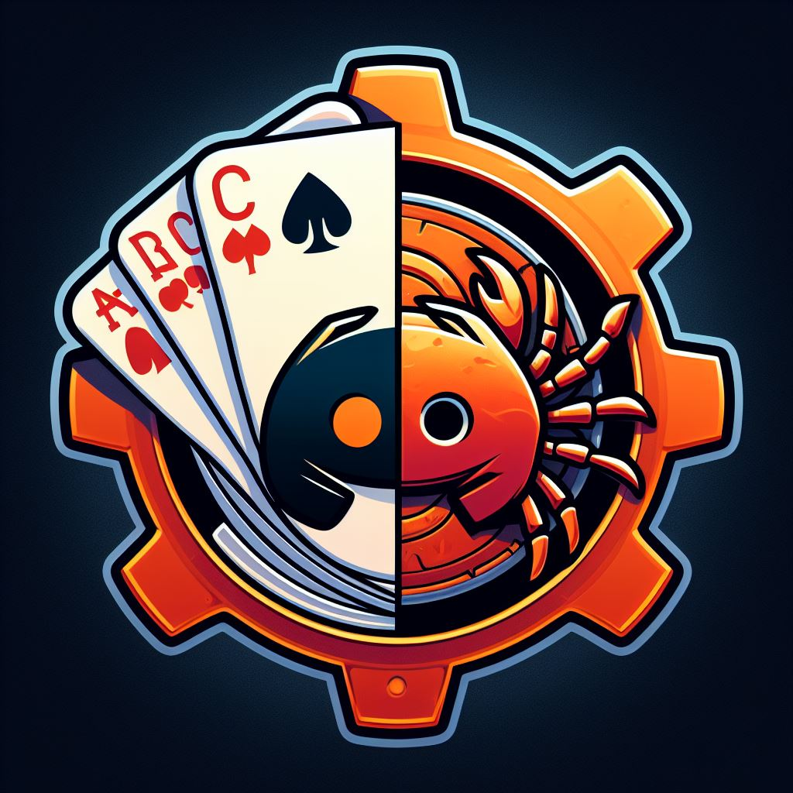

# Discord Tournament Points Bot



This project is a Dockerized Discord bot written in Rust, designed to keep track of points won in tournaments.

To learn more about the technologies used in this project, you can check out the following documentation:

## Deployment

To deploy this project run

```bash
  docker build -t <PROJECT_NAME> .
```

```bash
  docker run -e DISCORD_TOKEN=<ID> DB_PATH=<DB_PATH> ROLE_ADMIN=<ROLE_ID> <containerImage>
```

## Discord Slash Commands

#### Create Tournament

```http
  /create_tournament ${fecha} ROLE NEEDED
```

| Parameter | Type         | Description                      |
| :-------- | :----------- | :------------------------------- |
| `fecha`   | `DD/MM/YYYY` | **Required**. Date of tournament |

#### Create guild_boss

```http
  /agree_boss ${user} ROLE NEEDED ONLY OWNER
```

| Parameter | Type     | Description                    |
| :-------- | :------- | :----------------------------- |
| `user`    | `string` | **Required**. ID/@Mention user |

#### Sumarized Points

```http
   /sum_points ${points} ${user} ${fecha} ROLE NEEDED
```

| Parameter | Type         | Description                      |
| :-------- | :----------- | :------------------------------- |
| `points`  | `INTEGER`    | **Required**. Number of BB       |
| `user`    | `string`     | **Required**. ID/@Mention user   |
| `fecha`   | `DD/MM/YYYY` | **Required**. Date of tournament |

#### Substract points

```http
   /sub_points ${points} ${user} ${fecha} ROLE NEEDED
```

| Parameter | Type         | Description                      |
| :-------- | :----------- | :------------------------------- |
| `points`  | `INTEGER`    | **Required**. Number of BB       |
| `user`    | `string`     | **Required**. ID/@Mention user   |
| `fecha`   | `DD/MM/YYYY` | **Required**. Date of tournament |

#### Give bounty

```http
   /give_bounty ${points} ${user} ${fecha} ${win} ROLE NEEDED
```

| Parameter | Type         | Description                                     |
| :-------- | :----------- | :---------------------------------------------- |
| `points`  | `INTEGER`    | **Required**. Number of BB                      |
| `user`    | `string`     | **Required**. ID/@Mention user                  |
| `fecha`   | `DD/MM/YYYY` | **Required**. Date of tournament                |
| `win`     | `Bool`       | **Required**. Win tournament TRUE, Bounty FALSE |

#### Give verified

```http
   /verifed ${user} ${verify} ROLE NEEDED
```

| Parameter | Type     | Description                                       |
| :-------- | :------- | :------------------------------------------------ |
| `user`    | `string` | **Required**. ID/@Mention user                    |
| `verify`  | `Bool`   | **Required**. Checked on bitmex TRUE or not FALSE |

#### TOP 10 tournament

```http
   /poker_top
```

#### Tournament ID TOP 10

```http
   /poker_top_tournament ${fecha}
```

| Parameter | Type         | Description                      |
| :-------- | :----------- | :------------------------------- |
| `fecha`   | `DD/MM/YYYY` | **Required**. Date of tournament |

#### GET user

```http
   /poker_search ${user}
```

| Parameter | Type     | Description                    |
| :-------- | :------- | :----------------------------- |
| `user`    | `string` | **Required**. ID/@Mention user |

## SQL

```sql
CREATE TABLE IF NOT EXISTS users (
    id INTEGER PRIMARY KEY,
    user_name TEXT NOT NULL,
    user_id INTEGER NOT NULL UNIQUE,
    points INTEGER,
    bitmex BOOLEAN DEFAULT 0,
    created_at TIMESTAMP,
    wins INTEGER DEFAULT 0,
    bounties INTEGER DEFAULT 0,
    updated_at DATETIME DEFAULT CURRENT_TIMESTAMP
);

CREATE TABLE IF NOT EXISTS tournaments (
    tournament_id INTEGER PRIMARY KEY,
    tournament_date DATE NOT NULL UNIQUE,
    bounties INTEGER
);

CREATE TABLE IF NOT EXISTS bounties (
    bounty_id INTEGER PRIMARY KEY,
    bounty_winner BOOLEAN DEFAULT 0,
    bounty_date TIMESTAMP,
    user_id INTEGER,
    tournament_id INTEGER,
    coins INTEGER,
    FOREIGN KEY(user_id) REFERENCES users(user_id),
    FOREIGN KEY(tournament_id) REFERENCES tournaments(tournament_date)
);

CREATE TABLE IF NOT EXISTS reward (
    id INTEGER PRIMARY KEY,
    tournament_id INTEGER,
    user_id INTEGER,
    points INTEGER,
    FOREIGN KEY(tournament_id) REFERENCES tournaments(tournament_date),
    FOREIGN KEY(user_id) REFERENCES users(user_id)
);

CREATE UNIQUE INDEX idx_bounty_winner ON bounties (tournament_id) WHERE bounty_winner = 1;
CREATE UNIQUE INDEX idx_reward ON reward (tournament_id, user_id);
```

### Tech Stack

- [Rust](https://www.rust-lang.org/)
- [Docker](https://www.docker.com/)
- [SQLite](https://sqlite.org/)

### CRATES

- [tokio](https://docs.rs/tokio/latest/tokio/)
- [serenity](https://docs.rs/serenity/latest/serenity/)
- [poise](https://docs.rs/poise/latest/poise/)
- [serde](https://docs.rs/serde/latest/serde/)
- [serde_json](https://docs.rs/serde_json/latest/serde_json/index.html)
- [rusqlite](https://docs.rs/rusqlite/latest/rusqlite/)

#### Weird shit

- [ErrorPath](https://stackoverflow.com/questions/7250130/how-to-stop-mingw-and-msys-from-mangling-path-names-given-at-the-command-line/34386471#34386471)
